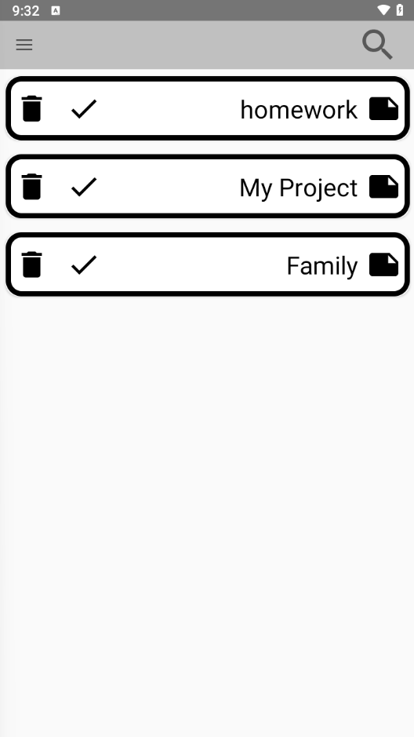
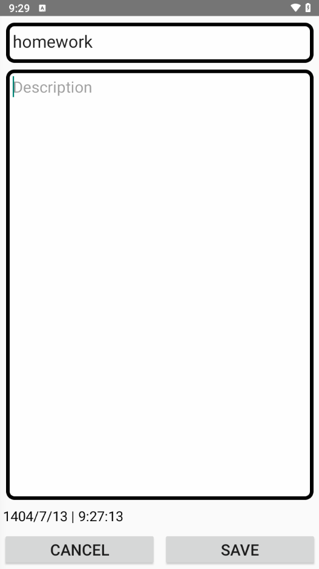
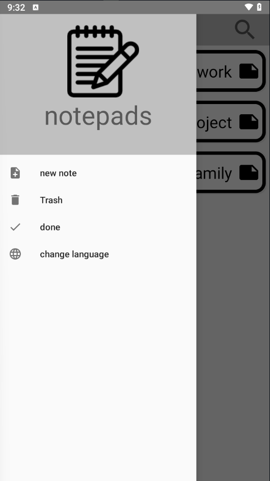

# 📝 To-Do Note App

This project is my **first Android application**, created around **June 2024**.  
The main purpose of this project was to **learn and practice key Android fundamentals**, such as:

- Using **SQL Database** for local data storage  
- Implementing **RecyclerView** for displaying lists  
- Adding **multi-language (localization)** support in the app  

---

## 📘 Overview
The app is a simple **To-Do List / Note Taking application** that allows users to:
- Add, edit, and delete notes or tasks  
- View all notes in a clean list format  
- Switch between different languages (for example, English and Persian)  

Although this project is basic, it represents an important step in my Android development journey — where I learned how different components of an app connect together.

---

## 🧠 What I Learned
- Basics of **SQLite** databases  
- Handling **RecyclerView Adapters** and ViewHolders  
- Managing multiple **languages and resources** in Android  
- Structuring a small project from scratch  

---

## 📸 Screenshots
Below are some screenshots of the app in action 👇  

---

## 🛠️ Tech Stack
- **Language:** Kotlin  
- **UI:** XML Layouts  
- **Database:** SQLite 
